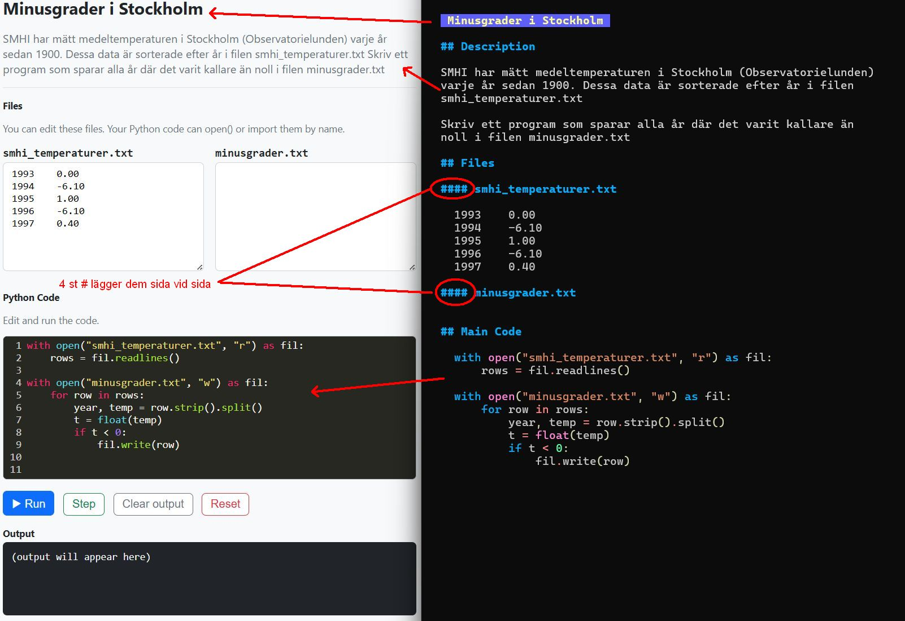
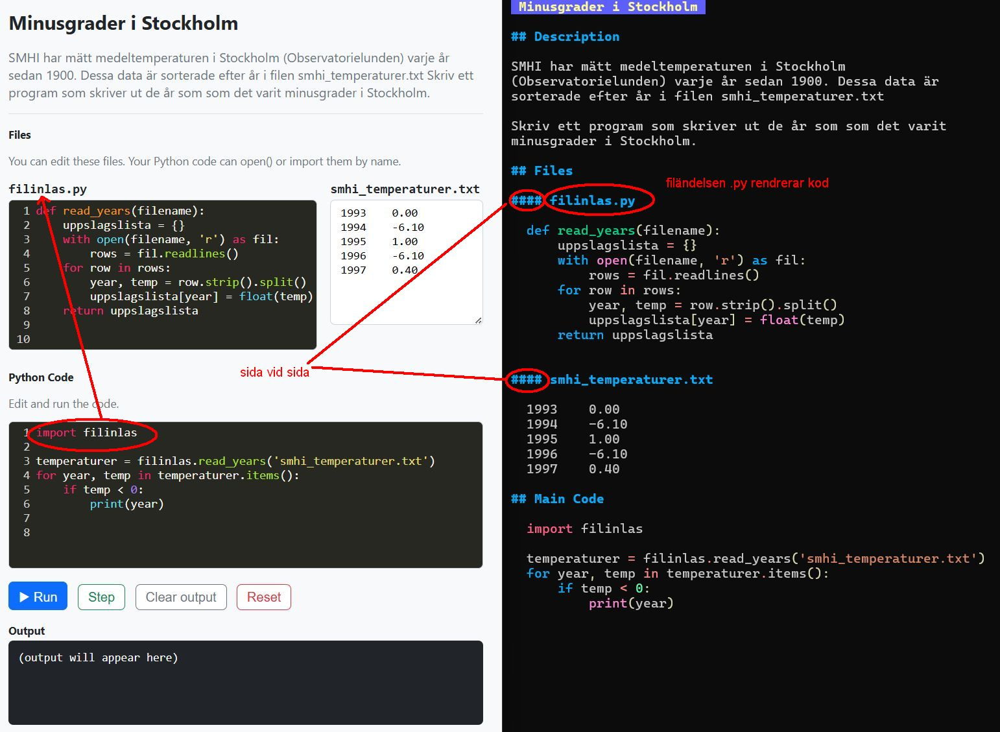
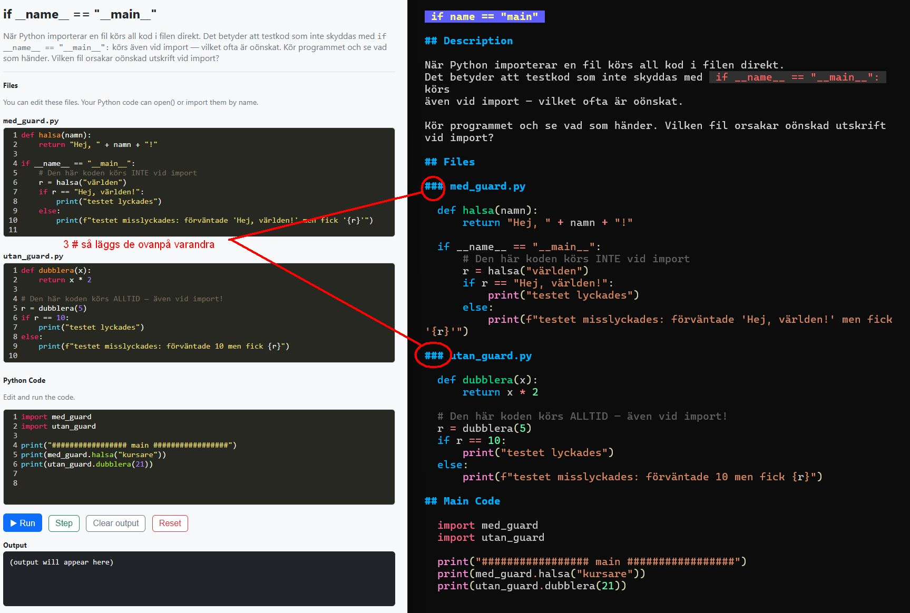

# Writing exercises

Exercises are markdown files in `src/`. Each file follows this structure:

```
# Title
## Description
## Files          (optional)
## Main Code
```

---

## `# Title`

The exercise title, shown at the top of the page.

## `## Description`

Plain text explaining what the student should do. Use `` `backticks` `` for inline code.

## `## Files` (optional)

File panes that the student can see and edit alongside the main code.
Each file is a subheading followed by a fenced code block.
`.py` files get syntax highlighting automatically.

There are two layout options:

- **`###` filename** — full-width file pane, one per row (files stack vertically)
- **`####` filename** — side-by-side with adjacent `####` panes (files share a row)

If this section is omitted, the exercise shows only the main code editor.

### Side-by-side with `####`

Two `####` file panes placed next to each other:



The markdown on the right maps to the rendered page on the left:
- `## Description` → the description text at the top
- `#### smhi_temperaturer.txt` and `#### minusgrader.txt` → two file panes side by side
- `## Main Code` → the code editor at the bottom

### Full-width with `###`

Each `###` file pane takes the full width, stacked vertically:



Here `### filinlas.py` and `### smhi_temperaturer.txt` each get their own full-width row.

### Stacked full-width example

Another example with `###` — two full-width files stacked on top of each other:



`### med_guard.py` and `### utan_guard.py` are each displayed in their own row.

## `## Main Code`

The code the student edits and runs, in a fenced `` ```python `` block.

---

## Full example

````markdown
# Minusgrader i Stockholm

## Description
Skriv ett program som skriver ut de år det varit minusgrader.

## Files
#### smhi_temperaturer.txt
```
1993    0.00
1994    -6.10
1995    1.00
```

#### minusgrader.txt
```
```

## Main Code
```python
with open("smhi_temperaturer.txt", "r") as fil:
    rows = fil.readlines()

with open("minusgrader.txt", "w") as fil:
    for row in rows:
        year, temp = row.strip().split()
        if float(temp) < 0:
            fil.write(row)
```
````

---

## Generate HTML

```bash
python3 generate.py src/                         # all folders → out/<folder>/*.html
python3 generate.py src/kapitel_1/               # one folder  → out/*.html (flat)
python3 generate.py src/kapitel_1/trinket1.md    # one file    → out/trinket1.html
```
